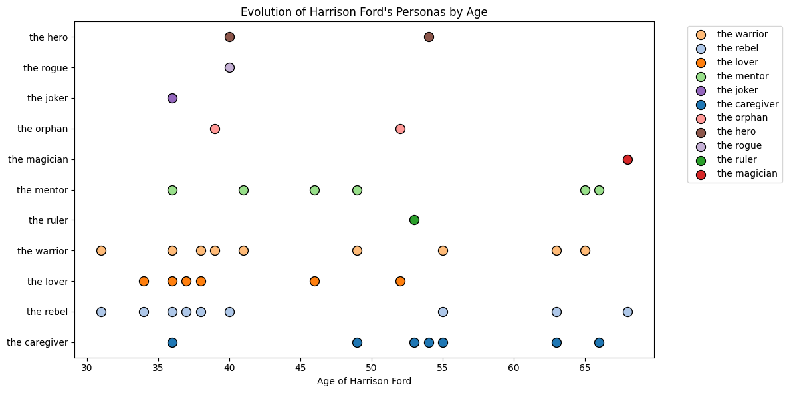
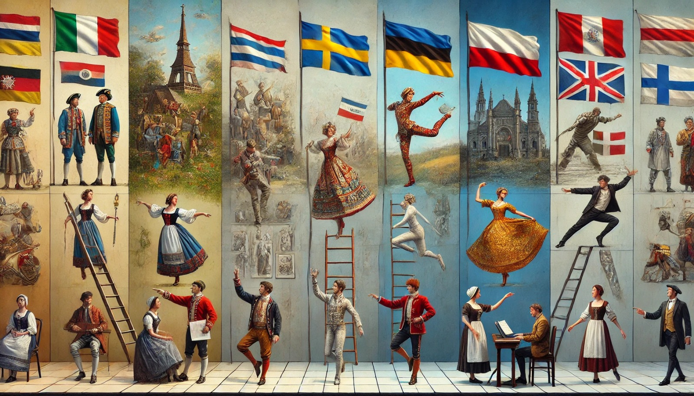

# Defining Success in Acting: Analysing Career Paths, Role Choices, and Film Impact

# Introduction

    The primary objective of our analysis is to identify the key factors that contribute to the success of an actor's career.
       
    To achieve this, we need firstly to establish metrics to evaluate an actor's popularity in the cinematographic field.
    In the first part of our analysis, we develop a popularity score based on two main factors: audience opinions on the films 
    an actor has participated in and the box office performance of those films.  
    In the second part, we create another score that measures the cultural impact of the actor, derived from the number 
    of nominations and awards achieved in the Oscars category.  
    Next, we aim to analyze the film genres in which actors predominantly work and the changes through their life as well as the common pattern between actors.  
    In the fourth part, we associate each role played by an actor with a specific persona. We will then investigate which 
    of these personas are most commonly linked to success. Additionally, we will explore complementary professions or activities 
    often undertaken by actors and determine how these align with their personas.  
    Finally, in the last part of the analysis, we use the two popularity scores calculated earlier to evaluate whether factors 
    such as family background (parents and spouses), nationality, and educational background influence an actor’s popularity. 
    We will also examine whether most actors exclusively work in their home countries or prefer to perform in foreign film production countries.

# How can we define a good actor's performance based on the film’s success he performed in ?

## Analyzing Actors’ Films by Ratings and Votes

    

        This graph explores the relationship between IMDb ratings and the number of votes for films featuring
        selected actors. By focusing on these metrics, we examine trends in audience engagement and critical 
        acclaim across their filmographies, highlighting how popular and well-received their performances are.  
        Below, you can see a scatter plot of the filmography of the top 250 actors. The top 5 actors (Samuel 
        L.Jackson, Morgan Freeman, Tom Hanks, Brad Pitt and Hugo Weaving) are already selected. You can select or
        deselect actors by clicking on their name or double click to select them all or only one.
    

    <figure>
        
        <figcaption style="text-align: center"> Generated using AI</figcaption>
    </figure>

<iframe src="src/graphs/actor_movies_rating_graph.html" width="1200" height="800" ></iframe>

    Here, we will focus on successful actors such as Samuel L.Jackson, Morgan Freeman, Tom Hanks, Brad Pitt and 
    Hugo Weaving. While observing their filmography, we notice a trend where a high number of votes correlates with 
    higher average ratings. Furthermore, many of the most popular films featuring these actors also tend to accumulate
    a high number of votes.  
    Now, consider Jurassic Park and Star Wars Episode I: The Phantom Menace. Both films have a similar number of votes
    and box office earnings (approximately $915 million and $1 billion, respectively). However, their ratings 
    differ significantly: 8.2 for Jurassic Park versus 6.5 for The Phantom Menace. Similarly, The Lord of the Rings 
    trilogy have a comparable box office revenue to these films while having a higher average ratings and a larger 
    number of votes.

## Comparing Ratings, Votes, Box Office, and Budget

    

        This graph explores the financial and critical aspects of film success, incorporating box 
        office revenue and budget alongside ratings and votes. By analyzing these combined factors, we aim to 
        highlight patterns that connect a film’s financial performance with its critical success.  
        Below, you can see a scatter plot of all the films with a defined average rating, number of vote, budget and 
        box office revenue. You can zoom in by selecting the area or zoom out by double clicking. You can also
        move by clicking on the arrows named plan on the top right of the graph.
    

    <figure>
        
        <figcaption style="text-align: center"> Generated using AI</figcaption>
    </figure>

<iframe src="src/graphs/movies_budget_revenue_ratings_graph.html" width="1200" height="800"></iframe>

    In this representation, we observe that a high budget and high ratings do not always guarantee a high box office.
    For example, The Dark Knight, while critically acclaimed on IMDB, achieved less than half the box office revenue 
    of Avatar, Titanic and The avengers. On the other hand, the Pirates of the Caribbean series features a very high 
    budget with a high box office but movies with significantly less budget managed to gain comparable box office 
    revenue.  
    As we saw, a high budget does not necessarily correlate with high box office revenue. for instance, Star 
    Wars Episode IV: A New Hope has a budget of $11 million but earned $775 million at the box office. Similarly, 
    The Lord of the Rings trilogy with each a budget of around $90 million and each generated around $1 billion in 
    box office revenue. Meanwhile, the films with the highest box office revenues are in the $200-250 millions range.
    Some of the most critically acclaimed titles such as The Lord of the Rings trilogy, Inception and The Dark Knight
    performed well in box office revenue, but they still did not beat the top films box office revenue.  
    Conversely, some critically acclaimed films like Pulp Fiction, The Godfather and The Shawshank Redemption 
    have relatively small budgets and box office revenues. This underlines the notion that a film's success can be 
    independent of its budget and box office revenue. Using the number of votes can help identify successful films. 
    By only using the number of votes, we can highlight critically acclaimed films and the actors that performed 
    in them, without using the box office revenue and budget.

# How can we measure the impact of an award on an actor's career in the cinematic field ?

## todo

    

        Explication graph
    

    <figure>
        
        <figcaption style="text-align: center"> Generated using AI</figcaption>
    </figure>

<iframe src="src/graphs/Actors_Awards_Sunburst.html" width="1200" height="800" ></iframe>

    Analysis of graph

## todo

    

        Explication graph
    

    <figure>
        
        <figcaption style="text-align: center"> Generated using AI</figcaption>
    </figure>

<iframe src="src/graphs/actor_awards_votes_graphs.html" width="1200" height="800" ></iframe>

    Analysis of graph

# What characteristics make an actor’s career successful ?

## Are the personas found relevant ? Relationship between a persona and the character occupation played by an actor in a movie

    

        We have extracted only a relatively small proportion of occupations per characters originally. As a result, 
        this part doesn't represent a major part of our analysis. However, they provide an interesting opportunity 
        to validate the personas previously extracted using an LLM. By linking characters' occupations to their 
        assigned personas, we can evaluate the relevance of the personas extracted from film summaries by comparing 
        them to the occupations list of the characters. We can also argue that the characters with a defined list of 
        occupations are likely the most popular, as the occupations list was retrieved from Wikidata. It is reasonable 
        to assume that only the more popular characters are documented on Wikidata.  
        Below, you can see an interactive bar chart displaying the distribution of the Top-20 most frequent character 
        occupations for each of the 12 personas defined in our analysis. You can use the picker located in the top-right 
        corner of the graph to select the persona for which you want to display the top 20 most common character occupations 
        associated with it.
    

    <figure>
        
        <figcaption style="text-align: center"> Generated using AI</figcaption>
    </figure>

<iframe src="src/graphs/personas_characters_occupations_relations_graph_interactive.html" width="1200" height="800"></iframe>

    - The <b>warrior</b> persona is primarily linked to occupations such as <b>vigilante</b>, <b>swordfighter</b>, 
    <b>superhero</b>, <b>soldier</b>, <b>martial artist</b> and <b>private investigator</b>. These are common attributes 
    and professions associated with the <b>warrior</b> persona.  
    - The <b>rebel</b> persona, on the other hand, is more closely linked to darker occupations such as <b>serial killer</b>,
    <b>mass murderer</b>, <b>terrorist</b> and <b>spy</b>. However, it is also associated with more heroic professions like 
    <b>superhero</b>, <b>vigilante</b>, and <b>swordfighter</b>, which may represent anti-hero or versatile roles.  
    - The <b>joker</b> persona is most strongly linked to occupations like <b>handyman</b> and <b>swordfighter</b>, with 
    additional occupations that don't have a direct connection to humor. This makes it difficult to fully evaluate the 
    relevance of the <b>joker</b> persona affectation.  
    - The <b>caregiver</b> persona is also associated with occupations that are not directly linked to the healthcare 
    field. However, we can also define the <b>caregiver</b> persona has a character who assist the main character in his 
    quest. Occupations like <b>superhero</b>, <b>vigilante</b>, or <b>reporter</b> (in the case of police films) fit this 
    definition, as they represent occupations that often help the main characters in his quest.  
    - The <b>ruler</b> persona is associated with negative occupations like <b>terrorist</b>, <b>serial killer</b> and 
    <b>mass murderer</b>, which could align with the representation of a villainous leader commonly seen in films. It is 
    also linked to more traditional leadership roles such as <b>chief executive officer</b>, <b>ruler</b>, <b>crime boss</b> 
    or <b>monarch</b>.  
    - The <b>mentor</b> persona is strongly associated with occupations that play significant roles in the storyline, such 
    as <b>private investigator</b>, <b>vigilante</b>, <b>martial artist</b>, <b>detective</b> and <b>superhero</b>. This 
    makes sense, as the <b>mentor</b> persona often holds an important position in the narrative, who is guiding or forming 
    another important character.  
    - The <b>lover</b> persona is linked to occupations like <b>high school student</b>, <b>reporter</b>, and <b>student</b>, 
    which are common in romantic films. It is also associated with dominant film roles such as <b>swordfighter</b>, <b>vigilante</b>, 
    <b>superhero</b> and <b>martial artist</b>, which complement the <b>lover</b> persona since these role represent 
    dominant characters.  
    - The <b>seducer</b> persona is associated with darker roles such as <b>serial killer</b> or <b>murderer</b>, explained 
    by the manipulative traits present in these roles, which is coherent with the <b>seducer</b> persona. It is also linked 
    to more dominant personas like <b>soldier</b>, <b>superhero</b>, and <b>actor</b>, which makes sense as these characters
    may represent desirable traits.  
    - The <b>magician</b> persona is connected to occupations like <b>magician</b>, <b>crime boss</b>, <b>alchemist</b> and
    <b>chemist</b>, highlighting the relevance of the persona's traits. In the same time, it is also associated with darker 
    occupations like <b>serial killer</b>, <b>criminal</b> and <b>terrorist</b>. This suggests that magicians are often 
    represented as characters with darker aspects.  
    - It is challenging to fully evaluate the relevance of the <b>orphan</b> persona, even it is linked to occupations like 
    <b>student</b> and <b>soldier</b> roles often performed by orphaned characters in movies.  
    - The <b>creator</b> persona is linked to a broad range of occupations, many of which are connected to the innovative 
    field, such as <b>inventor</b>, <b>scientist</b> and <b>writer</b>.  
    - The <b>child</b> persona is predominantly associated with occupations like <b>schoolchild</b> and <b>student</b>, 
    which is appropriate for this role.  
    Overall, most personas show their relevance through this analysis, even though the <b>joker</b> persona is harder 
    to evaluate due to the lack of direct occupations linked to humor.  

## What are the preferred film genres of successful actors?

    Whether it's comedy, drama, action, or another genre, actors frequently have favorite film genres in which they want to work. 
    Do these preferences, however, hold true over the course of their careers? How frequently do actors switch to a different genre, maybe to take on new challenges or adjust to shifting fashions? 
    What's more interesting is whether an actor's career is related to how consistently they choose their genres. 
    Are the most successful actors more inclined to switch between several storytelling approaches or do they often stick to one?

    Analyzing performers' "genre history"—that is, their inclinations toward different genres throughout time—would be crucial to answering this question. 
    An engaging method to investigate this is using the interactive plot below. Through the use of the CMU dataset, which includes the actor's age at the time of each film's release, the genres of the films they starred in, and a success metric, 
    we are able to graphically depict the progression of the actors' genre preferences—from the most well-known to the less well-known.

<iframe src="src/graphs/actors_preferred_genres_by_age.html" width="1200" height="800"></iframe>

    It exposes intriguing trends: some actors show some good adaptability in switching their specialty, 
    while others stick to a particular genre throughout their careers. 
    Even though performers typically stay within their preferred genres, even little changes in their selections might yield fascinating insights.

    One noteworthy pattern is that actors who are liking drama usually stick with it, and intriguingly tend to play some thriller roles at the end of their career. 
    On the other hand, comedic performers tend to move away from comedy as their careers goes and instead choose drama or adventure movies.

    All things considered, this plot offers a lot of information, providing a thorough and complex look at how actors' tastes in genre change throughout their careers. 
    In addition to the highlighting of the consistency or variation in their decisions, 
    it also provides information into both individual career paths and more general industry patterns. 
    For example, switching from comedy to drama or adventure could be a reaction to audience tastes or an actor's wish to take on more difficult roles. 
    This visualization offers an unmatched glimpse into how cinema careers change, develop, or remain firmly planted in particular creative domains by showing the favorite genres at different points in an actor's life.

## The Diversity in the actors occupations/professions. 

    

        An actor, in addition to their main profession, could have engaged in many other types of occupations 
        throughout their career. These complementary occupations can provide an interesting perspective on the 
        actor's skills. Comparing the occupations an actor has pursued with the different personas they have performed 
        along his career can offer an overview of the skills and qualities required to act a given persona.  
        Below, you can see a bar chart highlighting the distribution of the top 20 most common occupations across 
        the 12 personas defined earlier in our analysis. You can use the picker located in the top-right corner of the 
        graph to select the persona for which you want to display the top 20 most common actor occupations associated 
        with it. For this visualization, we exclude actor's occupations "actor", "film actor" and "television actor", as 
        they are very closed to the core profession of acting. 
    

    <figure>
        
        <figcaption style="text-align: center"> Actor Professions/Occupations Diversity: Generated using AI</figcaption>
    </figure>

<iframe src="src/graphs/personas_actors_occupations_relations_graph_interactive.html" width="1200" height="800"></iframe>

    The personas <b>the orphan</b>, <b>the ruler</b>, <b>the warrior</b>, <b>the seducer</b>, <b>the lover</b>, 
    <b>the mentor</b>, <b>the rebel</b>, <b>the caregiver</b>, and <b>the creator</b> all share the occupation 
    <b>stage actor</b> as the most frequent in their respective distributions, appearing between 600 and 1,400 times 
    in the actor's occupations for each persona. This suggests that experience in stage acting may significantly 
    contribute to an actor's ability to perform major personas in films.  
    Occupations such as <b>screenwriter</b>, <b>film producer</b> and <b>film director</b> are also highly present, 
    appearing 450 to 900 times for each persona and frequently ranking in the Top-5 occupations. Although not directly 
    related to acting, these roles may help actors gain a deeper understanding of film production processes. For 
    instance, screenwriting experience may enhance an actor’s ability to interpret and deliver a script effectively.  
    The persona <b>the orphan</b> is closely linked to the occupations <b>voice actor</b> (around 400 times) and 
    <b>singer</b> and <b>model</b> (each appearing approximately 380 times). This indicates that portraying this persona 
    often requires skills in vocal and physical expression, essential for conveying vulnerability and emotional depth.  
    For the persona <b>the magician</b>, the occupation <b>voice actor</b> is particularly prominent, suggesting that 
    this role demands strong vocal interpretation. This can be explained by the fact that the <b>magician</b> persona 
    often exists in fantasy world, requiring a fantastical and immersive vocal performance to enhance the audience's experience.  
    In the personas <b>the seducer</b> and <b>the lover</b>, the occupations <b>model</b> and <b>voice actor</b> frequently 
    appear in the Top-5 occupations, with counts of approximately 400 and 650 times, respectively. This reinforces the 
    idea that these personas require a strong ability to express emotions through both vocal performance (as a 
    <b>voice actor</b>) and physical presence (as a <b>model</b>). Additionally, <b>the lover</b> persona often involves 
    the occupation <b>singer</b> (appearing around 600 times), which aligns with its frequent representation in musical 
    comedies, requiring singing abilities.  
    For the persona <b>the rebel</b>, the occupations <b>voice actor</b> (around 950 times) and <b>singer</b> (around 
    600 times) are also prominent. This suggests that this persona often necessitates strong vocal skills to convey 
    various emotional nuances effectively.  
    For the persona <b>the mentor</b>, the occupation <b>stage actor</b> is the most present, appearing approximately 
    750 times, but <b>voice actor</b> is in second place, with around 520 occurrences. This suggests that this persona 
    demands strong acting skills, also very present in theater, where depth and intensity of expression are crucial.  
    The <b>caregiver</b> persona is particularly intriguing due to the wide variety of occupations associated with it, 
    each with a significant count. <b>Stage actor</b> appears most frequently (around 1,400 times), followed by 
    <b>voice actor</b> (approximately 1,000 times). Additionally, <b>singer</b> and <b>model</b> are also very present, 
    with counts of about 650 and 700 times. This indicates that the <b>caregiver</b> persona is multifaceted and requires 
    a diverse range of skills, including vocal skills expressions, physical expression, and emotional depth.  
    Similar to <b>the rebel</b>, the persona <b>the creator</b> is strongly linked to <b>stage actor</b> (about 550 times) 
    and <b>voice actor</b>, reinforcing the need for robust acting abilities to perform this role effectively.  
    The persona <b>the joker</b> is also closely associated with <b>stage actor</b> (around 500 times) and <b>voice actor</b> 
    (approximately 550 times). This reflects the role's demand for strong acting performances, with a particular focus 
    on vocal delivery to convey its humorous and expressive aspects.  
    Lastly, the persona <b>the child</b> is predominantly connected to <b>voice actor</b>, which is explained by the 
    fact that many child characters are acted by adults. This reliance on voice acting highlights the need for vocal 
    adaptability to convincingly represent young characters.  

# What are the career paths of successful actors? And are actors with similar paths also successful?

During the data processing step, we conceptualized a career as comprising two components: 
(1) a list of personas list representing personas of the role an actor played in each movie,
and (2) a corresponding list of the actor's age at the time of each movie. 
This dual representation allows us to visualize an actor's career path in the following manner.

<figure>
        
        <figcaption style="text-align: center"> Harrison Ford career as a sequence of personas through time</figcaption>
    </figure>

This initial representation, while detailed, is not ideal for comparing career paths due to its complexity. 
To simplify, we omitted the age component and vectorized the list of personas into a 12-dimensional vector for each movie. 
Assuming the sequence of movies is not critical, we aggregated these vectors by summing them across all movies in a career, 
resulting in a single 12-dimensional representation per career. 
Using this representation, we calculated a proximity score between careers based on the L1 distance. 
With these proximity scores, we identified the nearest paths to the most successful actors.

## Analysis on the success metric

We examine the k-nearest career paths for the 30 most successful actors, 
where success is quantified by summing the number of votes received for all movies an actor participates in. 
Using a slider interface, k varies in increments of 10, ranging from 10 to 100, 
enabling a detailed exploration of nearest-neighbor relationships based on this success metric across different levels of granularity.

<iframe src="src/graphs/K_neighbor_career_paths_success.html" width="1200" height="800"></iframe>

We observe that when k=10, the first quartile for most actors exceeds 100,000, and the median surpasses 1 million.
This suggests that, while they may not reach the success level of the top 30 actors, individuals with similar career paths tend to have at least moderately successful careers. 
However we find exceptions, for instance we can see with k=10 that an actor with a career path close to John Ratzenberger's has a low score of only 737. 
This demonstrates that having a career path similar to a highly successful actor does not always guarantee success.

We also observe that as k increases, the minimal score among the k-nearest neighbors decreases a lot for some actors. 
This could be explained by the fact that more distant paths are included, and there may not be k paths close enough to provide meaningful comparisons. 
To address this, we consider all paths within a certain threshold of similarity to each successful actor's path. 
This approach excludes paths that are too distant from the original, ensuring more relevant comparisons. 
However, it introduces flexibility in the number of data points analyzed, which could potentially result in missing or incomplete statistics. 

<iframe src="src/graphs/d_distance_career_paths_success.html" width="1200" height="800"></iframe>

The graph reveals that while some actors, such as John Ratzenberger, Warwick Davis, and Hugo Weaving, 
have unsuccessful actors with career paths close to theirs, others show a different trend. 
For instance, actors like Liam Neeson and Tom Cruise, who exhibit low minimum scores in the k-neighbors case, 
show no such low minimum when using the threshold-based approach. 
This suggests that the low minimum scores in the high-k scenario result from including actors with career paths that are too far. 
These findings indicate that certain career paths may inherently have fewer chances of leading to success.

## Analysis on the award metric

We repeat the previous analysis using the award score metric, 
which is based on the Oscar nominations and wins of the actor or the movies they have starred in,
weighted according to the categories.

<iframe src="src/graphs/K_neighbor_career_paths_award.html" width="1200" height="800"></iframe>

<iframe src="src/graphs/d_distance_career_paths_award.html" width="1200" height="800"></iframe>

For the award score, we observe that the median is quite low for most top actors, rarely exceeding 100. 
The minimum and even the first quartile are often zero or nearly zero. 
This indicates that having a career path similar to that of a top actor does not necessarily result in receiving many awards. 
This could be explained by the fact that awards are relatively rare, and moderately successful actors may not receive any, or only a few, throughout their careers.

This analysis reveals that while actors with career paths similar to top performers often show moderate or better success,
proximity alone does not guarantee high achievement. 
It also demonstrates that actors with similar paths to top actors may not receive many awards, and in many cases, may not receive any at all.
These findings highlight the complexity of success in the entertainment industry, where a similar career trajectory does not always lead to comparable outcomes.
Here’s a refined version of your paragraph with improved clarity and flow:

It is also important to note that the magnitude of the vectorized career depends on the number of movies an actor has played with each persona.
Therefore, for two actors to have similar career paths, they must have portrayed similar personas a comparable number of times. 
However, less successful actors are likely to be cast in fewer movies than top actors, so having a similar career path to a top actor likely indicates a certain level of success. 
This notion is supported by the results from the success metric analysis.

# Does the academic and environmental background of an actor have an impact on his career success ?

## Family environment

### Parents relations

    

        It is interesting to study whether having one or two parents in the cinematographic world could have a positive impact 
        on the success of an actor's career. You can see below a bar chart that presents the number of actors who have at least 
        one parent who is also an actor.
    

    <figure>
        
        <figcaption style="text-align: center"> Parents Influence: Generated using AI</figcaption>
    </figure>

<iframe src="src/graphs/actors_parents_number_distribution.html" width="1200" height="800"></iframe>

    In addition to the graph, the majority of actors (48,457) defined in our analysis do not have at least one parent in 
    the cinematographic field and therefore did not have parental influence in the acting industry. At the same time, we 
    can see from the graph that 971 actors have one actor parent, and 185 have both parents in the acting field. This is 
    very interesting, and we will now examine whether the popularity of actor parents could have a correlation with the 
    actor's popularity. Finally, there is one actor with three parents in the acting field, which could be the case in 
    a recomposed family.  
    You can see below an interactive scatter plot that present the relationship between an actor's popularity and one of their parent's 
    popularity. You can select the type of popularity score used to compare the two actors popularity: the <b>opinion score</b> 
    (extracted from Part 1), the <b>award score</b> (extracted from Part 2), and the <b>overall score</b> (a combination 
    of the opinion score and award score) using the picker in the top-right corner of the graph.

<iframe src="src/graphs/actors_parents_popularity_correlation.html" width="1200" height="800"></iframe>

    Now, we can see on the graph that some actors, such as Angelina Jolie, who have a very famous parent Jon Voight (by 
    using the <b>Overall Score</b> or the <b>Opinion Score</b>) are also very famous themselves. 
    These actors appear in the top-right corner of the graph, where both the actor's and parent's popularity scores are high.  
    However, there are also actors with famous parents who are not as famous themselves and they are positioned along 
    the y-axis. This suggests that despite having a well-known parent, their own popularity does not achieve the popularity 
    of their parent.  
    In opposition, there are famous actors who do not have famous parents. While this could indicate that the actor's success 
    is largely independent of their parent. We could also argue that the parent's influence could still play a role due 
    to their experience and knowledge of the cinematic field. Even if this influence is not evident in terms of popularity 
    scores, it might still have an impact on the actor's career. These actors are present along the x-axis and there is a 
    lot of actors in this case.  
    By navigating between the different scores, we can observe that the distribution of actors remains consistent. 
    However, the positions of specific (actor, actor parent) pairs change. For example, one of the top-ranked pairs 
    under the <b>Award Score</b> might be (Jane Fonda, Henry Fonda), while under the <b>Opinion Score</b>, it could be 
    (Angelina Jolie, Jon Voight).  
    <b>Pearson Correlation Score</b>  
    In complement of the graph, the correlation for the popularity score obtained from the <b>public's opinion</b> 
    (extracted from Part 1) between the actor and their parent is <b>0.109</b>. This means that the actor's popularity is very 
    slightly influenced by their parent’s <b>opinion score</b> popularity, as the covariance is very close to 0 this 
    influence is very not important. We observe the same pattern for the <b>award popularity score</b>(correlation : <b>0.041</b>) and the 
    <b>overall score</b> (correlation: <b>0.063</b>). Even though the influence is slightly smaller in these cases, since the correlation score is 
    more small. This is particularly evident for the overall score, as it is calculated using a combination of 
    the opinion and award scores. Therefore, while there is a small positive relationship along all the popularity score, 
    it is not significant enough to conclude that the actor's popularity is heavily dependent on the popularity of their 
    parents.  

### Spouses relations

    

       During their careers, actors can have one or more relationships with other actors. It could be interesting to study 
        these relationships and determine if they have an impact on the actor's popularity. The majority of actors (45,311) 
        do not have any relationships with other actors. However, many others have at least one relationship during their careers, 
        and you can see the distribution of the number of actor spouses in the graph below. 
    

    <figure>
        
        <figcaption style="text-align: center"> Spouses Influence: Generated using AI</figcaption>
    </figure>

<iframe src="src/graphs/actors_spouses_number_distribution.html" width="1200" height="800"></iframe>

    We can see on the graph that there is also a significant number of actors (4,055) who have had one actor spouse during their career. 
    Additionally, there are actors who have had 2, 3, 4, or even 5 actor spouses during their careers. We will now attempt 
    to understand if there is a link or correlation between the actor's popularity and the popularity of their spouse(s).  
    You can see below an interactive scatter plot that present the relationship between an actor's popularity and one of their spouse's 
    popularity. You can select the type of popularity score used to compare the two actors popularity: the <b>opinion score</b> 
    (extracted from Part 1), the <b>award score</b> (extracted from Part 2), and the <b>overall score</b> (a combination 
    of the opinion score and award score) using the picker in the top-right corner of the graph.

<iframe src="src/graphs/actors_spouses_popularity_correlation.html" width="1200" height="800"></iframe>

    On the graph, we can see that there are not many actors who are very popular in relation by using the <b>Opinion Score</b> 
    to their spouse. However, there are some notable cases, such as the relationship between Angelina Jolie and Brad Pitt, 
    as well as the relationship between Tom Cruise and Nicole Kidman, displayed in the top right corner.  
    At the same time, when using the Award Score, we notice a higher number of actors whit a high popularity score liked their 
    spouses (positioned at the center of the graph). For instance, Richard Burton and Elizabeth Taylor, both achieved high 
    <b>Award Scores</b>.  
    For all the scores, most of the actors are located along the x and y axes, indicating that one member of the couple is a more popular 
    actor than the other.  
    <b>Pearson Correlation Score</b>  
    In complement to the graph, the correlation of the <b>Opinion score</b> between the actor and their spouse is 
    <b>0.184</b> which is approximately twice as high as the correlation with their parent. This suggests that having a 
    relationship with a popular actor could have a small impact (since the correlation is still relatively small) on the 
    actor's popularity. We can make the same observation for the <b>Award score</b> (correlation: <b>0.158</b>) and the 
    <b>overall score</b>(correlation: <b>0.143</b>). Although the influence is small, similar to the case with parents, 
    it is still more important in the case of spouses.  

## Academic Background

    

        In our data, a large number of actors (around 20,000) have attended university courses. It could be interesting to 
        study which universities have produced the largest number of actors and which ones have produced the most successful 
        or popular actors.  
        You can see on the bar chart bellow the distribution of the number of actors in the top 20 universities with the highest 
        number of actors. 
    

    <figure>
        
        <figcaption style="text-align: center"> University Influence: Generated using AI</figcaption>
    </figure>

<iframe src="src/graphs/actors_universities_count_distribution.html" width="1200" height="800"></iframe>

    We can observe that many actors have attended American universities. And Los Angeles (even though it is not directly a university), 
    the University of California, and the Royal Academy of Dramatic Art(England) are the institutions with the highest number 
    of actor students. We will now consider the popularity of actor students who attended these institutions to evaluate 
    whether studying at these universities increases an actor's chances of becoming popular.  
    Below, you can see interactive bar that show the relationship between the popularity of actor from 
    a given university and the university itself. You can select the type of popularity score used to evaluate an actor's 
    popularity: the <b>Opinion score</b> (extracted from Part 1), the <b>Award score</b> (extracted from Part 2), and the 
    <b>Overall score</b> (a combination of the Opinion score and Award score), using the picker in the top-right corner of the graph.  
    The <b>weight parameter</b> represents the weight applied in the calculation of the University score, defined as:  
    <b>University Score = (1 - Weight) × Mean Popularity Score of actors in this university + Weight × Number of students in this university.</b>  
    The best university will have a university score close to one, representing the university most likely to produce popular actors. 
    - If we apply a <b>weight of one</b>, the calculation is based uniquely on the mean popularity score of actors, which may not be ideal 
    since a university with only two actors could achieve a high score without having a huge number of actors students. 
    - In opposition, if the weight is zero, the university score depends entirely on the number of students, without taking 
    into account their popularity, which might not reflect the quality of the university. 

<iframe src="src/graphs/actors_universities_popularity_relations_with_weight_0.html" width="1200" height="800"></iframe>

    If the <b>University Score</b> is calculated uniquely based on the average popularity score of actors who attended 
    a given university, we find that the universities presented (for all the popularity score use) are not particularly 
    relevant to the acting field (e.g., "Greenwood Public School (a public school in India)" or "Queen Elizabeth's Hospital"). 
    This can be explained by the fact that if only a small number of actors with high popularity scores attended a specific school, 
    the <b>University Score</b> will be disproportionately high. Conversely, for universities with a larger number of students, 
    achieving a great score becomes more challenging, as it depends on the collective popularity scores of a large group of actors.
    And the <b>University Score</b> are relatively important for the Top-3 Universities (between 0.65 and 0.75) which indicates 
    that the weight of 0 used for the University Score is not very adapted. 

<iframe src="src/graphs/actors_universities_popularity_relations_with_weight_0.25.html" width="1200" height="800"></iframe>

    If the <b>University Score</b> is primarily based on the average popularity score (accounting for 75% of the calculation) of actors 
    who attended a given university, we observe results similar to those obtained when a weight of 0 was used. However, 
    the <b>University Score</b> becomes smaller, indicating a reduced significance for universities unrelated to the acting field, 
    which is a positive outcome.

<iframe src="src/graphs/actors_universities_popularity_relations_with_weight_0.5.html" width="1200" height="800"></iframe>

    When the <b>University Score</b> is equally based on the average popularity score and the number of actors who attended a 
    given university,we observe that the top two in the universities ranking is "the University Los Angeles" and "the Royal Academy
    of Dramatic Art" who are relevant to the acting field across all popularity scores used. However, the rest of the rankings 
    appear less relevant when using the <b>Opinion Score</b>. In contrast, when using the <b>Award Score</b>, the rankings 
    remain relevant for the top five universities. The <b>University Score</b> for the most relevant institutions ranges between 0.4 and 0.5.

<iframe src="src/graphs/actors_universities_popularity_relations_with_weight_0.75.html" width="1200" height="800"></iframe>

    

    When the <b>University Score</b> is mostly based on actor count (75%) and minimally on the actors popularity (25%) 
    for a given university, the resulting rankings appear more relevant. The rankings highlight prestigious universities 
    in the acting field, such as the Royal Academy of Dramatic Art, the American Academy of Dramatic Art, and New York 
    University Tisch School of the Arts. We also observe that only the last university in the rankings changes depending 
    on whether the <b>Award Score</b> or the <b>Opinion Score</b> is used. Furthermore, the <b>University Score</b> becomes 
    more meaningful, with the most relevant university achieving a score of 0.75.  
    In conclusion, the greater the weight assigned to actor count in the calculation, the more accurate the results become. 
    This is because increasing the weight increases the likelihood of an actor attending a given university, thereby improving 
    the overall relevance of the rankings. It is the same principle as when we search for opinions online: the greater the 
    number of opinions, the more accurate and representative the overall evaluation becomes.

## Nationality impact

    

        Actors come from all over the world, and some have more than one nationality. It would be interesting to identify the 
        most representative nationalities in the acting profession, determine which nationality has the highest number of popular 
        actors, and explore whether a particular nationality could influence an actor's popularity.  
        The bar chart below shows the distribution of the number of actors by nationality.
    

    <figure>
        
        <figcaption style="text-align: center"> Nationality Influence: Generated using AI</figcaption>
    </figure>

<iframe src="src/graphs/actors_nationalities_count_distribution.html" width="1200" height="800"></iframe>

    We can see on the graph that the most representative nationality is the United States, with 17,921 actors, followed 
    by the United Kingdom with 5,393 actors and India with 2,525 actors. The United States is by far the dominant nationality, 
    likely explained by the presence of Hollywood. The third place of India can be explained by the presence of Bollywood. 
    We will now study which nationality contains the most popular actors  .
    Below, you can see interactive bar plots that show the relationship between the popularity of actor with 
    a given nationality and the nationality itself. You can select the type of popularity score used to evaluate an actor's 
    popularity: the <b>opinion score</b> (extracted from Part 1), the <b>award score</b> (extracted from Part 2), and the 
    <b>overall score</b> (a combination of the opinion score and award score), using the picker in the top-right corner of the graph.  
    The <b>weight parameter</b> represents the weight applied in the calculation of the nationality score, defined as:  
    <b>Nationality Score = (1 - Weight) × Mean Popularity Score of actors with the given nationality + Weight × Number of students 
    with the given nationality.</b>  
    The best nationality will have a nationality score close to one, representing the nationality most likely to have popular actors. 
    - If we apply a <b>weight of one</b>, the calculation is based uniquely on the mean popularity score of actors, which may not be ideal 
    since a nationality with only two actors could achieve a high score without having a huge number of actors (Ex: Gabon). 
    - In opposition, if the weight is zero, the nationality score depends entirely on the number of actors, without taking 
    into account their popularity, which might not reflect the influence of a nationality in actor's popularity. 
    For our analysis, we split actors with more than one nationality into multiple rows, considering that their influence 
    is equal in all the countries of their nationalities.

<iframe src="src/graphs/actors_nationalities_popularity_relations_with_weight_0.25.html" width="1200" height="800"></iframe>

<iframe src="src/graphs/actors_nationalities_popularity_relations_with_weight_0.5.html" width="1200" height="800"></iframe>

<iframe src="src/graphs/actors_nationalities_popularity_relations_with_weight_0.75.html" width="1200" height="800"></iframe>

   As with the university rankings discussed earlier, we observe that placing greater weight on the number of actors in 
    each nationality group, while assigning less weight to the average popularity score of those actors, results in a 
    more accurate Nationality Ranking. When the weight on actor popularity is small, nationalities like Gabon 
    appear prominently in the rankings. This occurs because our dataset includes two highly famous actors from Gabon, 
    making the ranking for Gabon based on these two individuals, which is correct but can bias our <b>Nationality Score</b>.
    Furthermore, as the weight given to actor count increases, the Nationality Score for the top-ranking nationality also increases. 
    By increasing the weight, the probability of an actor achieving popularity in the leading country also increases. The distribution
    and Nationality score remains the same for the different popularity scores used.
    

## Perform in their own country or pursue performing abroad ?

    

        After studying the impact of nationality on actors, it could be interesting to see if actors perform exclusively in 
        their own country or if they perform in foreign countries.   
        The graph below presents the distribution of actors based on whether they perform in their own country in their career 
        or uniquely in foreign countries.
    

    <figure>
        
        <figcaption style="text-align: center"> Generated using AI</figcaption>
    </figure>

<iframe src="src/graphs/actors_count_who_played_in_their_country.html" width="1200" height="800"></iframe>

    We observe that the majority of actors (238,517) have not performed in their home countries, suggesting that many 
    have had to travel abroad to advance their acting careers. It would now be interesting to explore in which countries 
    the most popular actors perform in or if te popular actors perform in their country.  
    Below, you can see an interactive scatter plot that show the relationship between the popularity of actors with 
    the country where they have performed to realize a movie. You can select the type of popularity score used to evaluate an actor's 
    popularity: the <b>opinion score</b> (extracted from Part 1), the <b>award score</b> (extracted from Part 2), and the 
    <b>overall score</b> (a combination of the opinion score and award score), using the picker in the top-right corner of the graph.  
    The <b>weight parameter</b> represents the weight applied in the calculation of the production's country score, defined as:  
    <b>Country Score = (1 - Weight) × Mean Popularity Score of actors who performed in this country + Weight × Number of students 
    with the given country.</b>  
    The best production's country will have a country score close to one, representing the production's country most likely to have popular actors. 
    - If we apply a <b>weight of one</b>, the calculation is based uniquely on the mean popularity score of actors, which may not be ideal 
    since a country with only two actors could achieve a high score without having a huge number of actors. 
    - In opposition, if the weight is zero, the country score depends entirely on the number of actors, without taking 
    into account their popularity, which might not reflect the influence of a country in actor's popularity. 
    In this case, we only display a graph using a weight of 0.75, as it proved to be more relevant for the nationality 
    and university rankings. We can therefore deduce that it will be equally relevant for this scenario. In the graph, 
    we define the actor's "Own Country" as the country corresponding to their nationality, while all other countries are 
    considered to foreign countries for the actor.

<iframe src="src/graphs/actors_performance_own_foreign_country_performance_distribution.html" width="1200" height="800"></iframe>

    The graph shows that most popular actors perform in their own country, with a dominant production score of 0.75 for 
    their home country. This can be explained by the fact that many of the most popular actors are American, and there 
    is a higher likelihood of performing in a country one is familiar with. For non-American actors, the United States 
    emerges as the country with the highest number of popular actors, likely due to the prominence of Hollywood. The third 
    place is taken by England. Therefore, we can conclude that actors generally have a greater chance of performing in 
    their own country. Even if the actors are not American, they still have a good chance of performing in the United States as well.

# Conclusion

    TO BE COMPLETED   
    To achieve a strong performance, a role defined by a given persona may require complementary occupations or professions 
    alongside an actor’s primary work. For example, many actors, especially those associated with certain personas, also have 
    experience in stage acting. This additional skills often enhances their ability to deliver nuanced performances or specialized performance (ex: singer).  
    TO BE COMPLETED   
    When examining the family environment of actors, it becomes evident that having a parent in the cinematographic field can significantly contribute to a successful career. 
    This is especially true if the parent was a successful actor, although even less successful parents may provide valuable insights and knowledge about the cinematographic industry. 
    In opposition, having a successful actor as a spouse does not appear to have a direct impact on an actor’s popularity. 
    However, a notable proportion of actors with high award scores also have spouses with similarly high awards score. 
    Attending a prestigious university can also contribute to a successful career. Among the most prominent institutions is the Royal Academy of Dramatic Art in England.
    Other top universities for actors are primarily located in the United States. 
    Regarding nationality, it comes as no surprise that the majority of successful actors are American, followed by actors from the United Kingdom and India. 
    Finally, most actors do not exclusively perform in their home countries, indicating the necessity of international mobility during their careers. 
    However, the most popular actors tend to perform primarily in their home countries (which may be influenced by fact that most of the popular actor are american).

